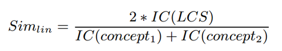

# 第一次作业

## 实验环境

本次实验在MacOS上使用nltk进行实验。本次实验使用wordnet，brown corpus，semcor corpus三个语料库以及google model，glove model进行分析，基于词典与语料库进行词汇相关度计算。

## 实验方法

### Path Similarity

两个词在wordnet中距离越近，相似度越高。

### Wu-Palmer Similarity

根据词典中两个点共同祖先对深度和两个词在词典中的深度计算的相似度：

### Resnik Similarity

将两个词的最低共同祖先节点的信息内容作为衡量标准。公共包容节点在层次结构中位置越低，相似性越大。在本次实验中，我们使用brown语料库和semcor语料库进行计算。

simresnik(c1,c2) = -log P(LCS(c1,c2))

### Jiang-Conrath Similarity

基于语料库的一种词汇相似度计算方法，公式如下：

### Lin Similarity

基于语料库的一种词汇相似度计算方法，公式如下：

### Word2Vec Similarity

Word2Vec即将词语转换为向量。两个词对相似度即两个向量的差。我们使用google训练好的部分模型和glove模型对词汇进行word2vec相似度分析。

### 评价方式

我们使用Spearman rank Correlation进行对实验结果对评测：

## 结果

| method                                | correlation         |
| ------------------------------------- | ------------------- |
| path similarity                       | 0.5067836948490696  |
| wup similarity                        | 0.35244533767828906 |
| res similarity with brown corpus      | 0.37038459810485574 |
| res similarity with semcor corpus     | 0.3404748062858764  |
| jcn similarity with brown corpus      | 0.5175495833915609  |
| jcn similarity with semcor corpus     | 0.5222242356175089  |
| lin similarity with brown corpus      | 0.40557437939172825 |
| lin similarity with semcor corpus     | 0.45439720548884915 |
| word2vec similarity with google model | 0.6713097016879209  |
| word2vec similarity with glove model  | 0.6500829276838272  |

## 结果分析

通过实验结果我们可以看到word2vec方法可以达到本次实验对最好的效果，而google训练的模型效果略好于glove模型。但是该方法的问题是训练成本很高，需要巨大的语料资源和计算资源。而其它方法只需要较小的语料库和计算资源。因此，在处理简单问题时，我们可以直接选用基于语料库或者词典的算法或者直接使用训练好的模型。