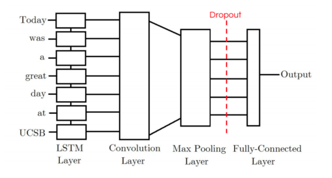
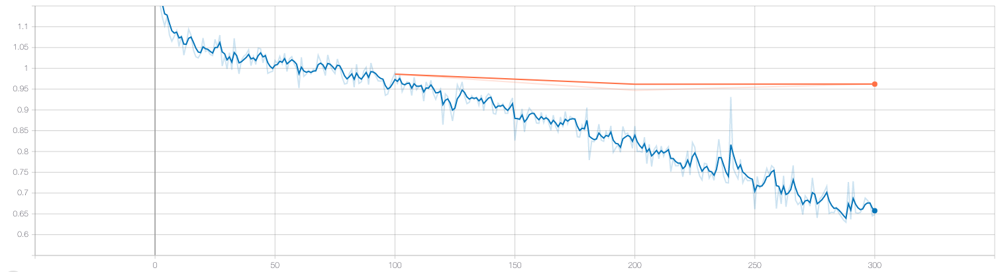
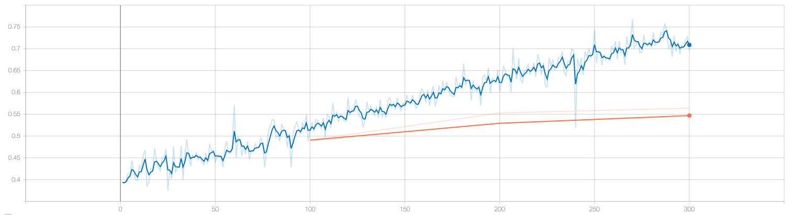

# SemEval2017 Task 4 Subtask A

> 由于笔者并不是搞深度学习或者NLP神马的，所以实际上并不太清楚一个writeup应该涉及到哪些内容，读者海涵。

## 参考

### CS291K

<https://github.com/pmsosa/CS291K>

这个repo介绍了四种网络用来进行情感分析，分别为LSTM，CNN，CNN-LSTM， LSTM-CNN。本次作业我借鉴了在该项目中效果最好的LSTM-CNN网络。

### GloVe

<https://nlp.stanford.edu/projects/glove/>

本次项目直接使用了GloVe中训练好的`GloVe.6B.50d`训练结果，省去了word2vec对训练。

## 数据处理

在`data_loader.py`中，我们进行数据对预处理。在句子中，我们处理以下几种要素：

* 颜文字
* 艾特（ @ ）
* 网址
* 奇怪的UNICODE
* 后缀缩写（ `n't`， `'ll`， `'s`， `'ve`……）

进行清洗后，我们将每条推文通过GloVe的Word2Vec转化为向量表示。

## 网络结构

本次作业借鉴了[CS219K](https://github.com/pmsosa/CS291K)所提出的LSTM-CNN网络结构。网络结构图如下：

此模型第一层是一个LSTM层，其接受tweet中每个token的embedding信息，其保存了token的信息以及其上文的信息。可以理解为该层对原始输入生成了一个新的编码。第二层是卷积层，我们期望可以通过该层对LSTM层对结果提取局部特征。最后卷积层对数据结果被池化到一个较小对唯独，然后输出最终的结果。

在训练过程中我们loss的下降如下：

在训练集上的准确度结果如图：

我们使用`2017_English_final/GOLD`文件夹中的`twitter-2013train-A.txt`、`twitter-2015train-A.txt`、`twitter-2016train-A.txt`三个文件中的数据作为训练机，划分出10%作为交叉验证。

在我们随机划分出的交叉验证数据集上，准确率达到了60%左右。在测试集SemEval2017-task4-test.subtask-A.english.txt中，我们得到了51.90%的准确率。
